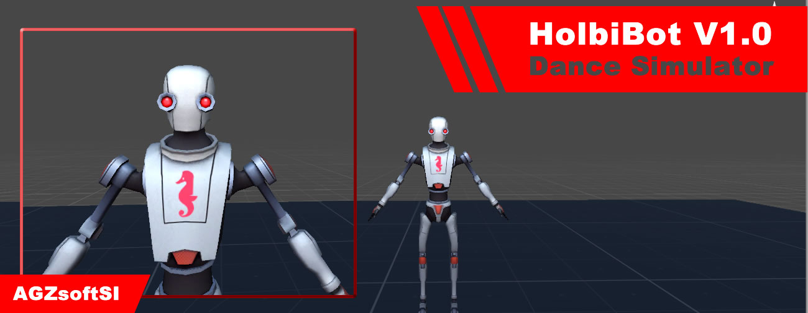

# Unity3D Animations Holbibot

# Description:

This project is just a Demo, where you use a free esset of a Unity3D character (Space Robot Kyle character), the objective was to edit some textures, create materials for the character, change its model to humanoid in order to apply different human mechanics such as dances.

In this repository you will find all the necessary content to review the operation of the animations, dance simulations in the character, each type of dance has its animation control, it is just adjust it and ready.

- Unity Version Used for this Project: Unity 2018.4.19f1 (64-bit)

# Project Content:

- Assets [Open](Assets/)

- Library [Open](Library/)

- Logs [Open](Logs/)

- Packages [Open](Packages/)

- ProjectSettings [Open](ProjectSettings/)

- VideosDemo [Open](VideosDemo/)

# Author:

Carlos Andres Garcia Morales [Gmail](agzsoftsi@gmail.com) - [Github](https://github.com/agzsoftsi) - [Twitter](https://twitter.com/karlgarmor)
